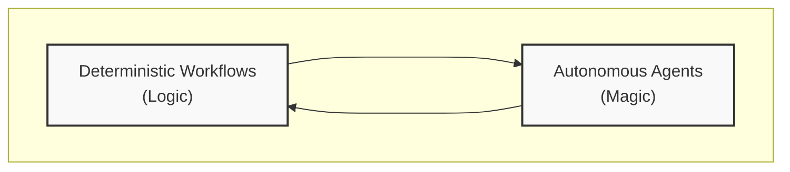

# Bridgic

[](https://opensource.org/licenses/MIT)
[](https://www.python.org/)
[](https://pypi.org/search/?q=bridgic)
[](https://pypi.org/search/?q=bridgic)

**Bridgic** is the next-generation agent development framework for building intelligent systems.

By redefining the boundary between workflows and agents, Bridgic introduces a unified orchestration and runtime model which enables developers to seamlessly transition between predictable workflows and autonomous, creative agents within one system.

> ✨ The name "**Bridgic**" embodies our core philosophy — **"Bridging Logic and Magic"**, where:
>   - *Logic* represents deterministic and predictable execution flows, forming the foundation of reliable systems.
>   - *Magic* refers to the autonomous parts that can make dynamic decisions and solve problems creatively.

<div align="center">



</div>


## 📦 Installation

Bridgic requires Python 3.9 or newer.

### Using pip

```bash
pip install bridgic
python -c "from bridgic.core import __version__; print(f'Bridgic version: {__version__}')"
```

### Using uv

```bash
uv add bridgic
uv run python -c "from bridgic.core import __version__; print(f'Bridgic version: {__version__}')"
```


## 🔗 Key Features

### 🌀 Core Runtime Engine

* **Unified DDG Foundation**: Both deterministic workflows and autonomous agents are orchestrated through the same [Dynamic Directed Graph](https://docs.bridgic.ai/latest/tutorials/items/core_mechanism/dynamic_topology/) runtime model, providing a unified foundation for intelligent systems.
* **Dynamic Topology & Routing**: The mechanism of [dynamic topology](https://docs.bridgic.ai/latest/tutorials/items/core_mechanism/dynamic_topology/) allows graph structure to be modified at runtime, while [dynamic routing](https://docs.bridgic.ai/latest/tutorials/items/core_mechanism/dynamic_routing/) enables conditional branching through an intuitive [`ferry_to()`](https://docs.bridgic.ai/latest/reference/bridgic-core/bridgic/core/automa/#bridgic.core.automa.GraphAutoma.ferry_to) API.
* **Multi-Layered Orchestration APIs**: Bridgic supports both a **Declarative API** and **[ASL (Agent Structure Language)](https://docs.bridgic.ai/latest/tutorials/items/asl/quick_start/)**, both powered by a unified DDG-based orchestration model, giving developers flexibility in how they structure their code.

### 🚀 Consistent Development Experience for Workflows and Agents

* **Program-defined Execution Mode**: Build deterministic workflows with explicit control flow, where execution paths are defined by your code structure.
* **Model-driven Autonomous Execution Mode**: Leverage [ReCentAutoma](https://docs.bridgic.ai/latest/tutorials/items/agentic_module/about_recent_automa.ipynb) and other autonomous agent modules where LLMs make dynamic decisions about tool selection and execution paths.

### 🧩 Modular Development Support

* **Modular Application Building**: Complex intelligent systems can be composed through [modularity](https://docs.bridgic.ai/latest/tutorials/items/core_mechanism/modularity/), enabling component reusing and hierarchical nesting.
* **Parameter Resolving & Binding**: The mechanism of [parameter resolving](https://docs.bridgic.ai/latest/tutorials/items/core_mechanism/parameter_resolving/) enables passing data among workers/automas, eliminating the complexity of global state management.
* **Agent Structure Language**: [ASL (Agent Structure Language)](https://docs.bridgic.ai/latest/tutorials/items/asl/quick_start/) is a Python-native DSL that enables developers to express sophisticated agentic structures within a limited amount of code, optimized for AI-assisted development.

### 👥 Powerful Human-in-the-Loop Support

* **Human Interaction Based on Asynchronous Awaiting**: Systems can pause execution and [await human feedback](https://docs.bridgic.ai/latest/tutorials/items/core_mechanism/human_in_the_loop/) asynchronously, enabling seamless integration of human judgment into automated workflows / agents.
* **Human Interaction Based on Interruption & Resuming**: Long-running systems can be [interrupted at any point](https://docs.bridgic.ai/latest/tutorials/items/core_mechanism/human_in_the_loop/#reimbursement-workflow) , request external feedbacks, and seamlessly resume execution with state persistence and recovery.

### 🔌 Seamless Third-Party Integration

* **Technology-neutral Model Integration**: [Model integration](https://docs.bridgic.ai/latest/tutorials/items/model_integration/) allows seamlessly integration with any LLM provider through a unified abstraction.
* **Systematic MCP Integration**: [MCP integration](https://docs.bridgic.ai/latest/tutorials/items/protocol_integration/mcp_quick_start/) allows your application to connect to MCP servers and to use their tools as first-class workers, in a systematic way in Bridgic.
* **Seamless Enterprise Observability Integration**: Support for integrating the leading observability platforms (like [Opik](https://docs.bridgic.ai/latest/tutorials/items/observability/opik_integration/), [LangWatch](https://docs.bridgic.ai/latest/tutorials/items/observability/lang_watch_integration/)) ensures your agentic systems are transparent, debuggable, and optimizable.

## 🚀 Get Started

This section demonstrates Bridgic's core capabilities through practical examples.

You'll learn how to build an intelligent system with Bridgic, from a simple chatbot to autonomous agentic system. In these cases, you will see features such as worker orchestration, dynamic routing, dynamic topology changing, and parameter resolving.

Part-I examples includes both implementations in normal APIs and ASL, showing how ASL simplifies workflow definition with declarative syntax.

### LLM Setup

Before diving into the examples, set up your LLM instance.

```python
import os
from bridgic.llms.openai import OpenAILlm, OpenAIConfiguration

_api_key = os.environ.get("OPENAI_API_KEY")
_api_base = os.environ.get("OPENAI_API_BASE")
_model_name = os.environ.get("OPENAI_MODEL_NAME")

llm = OpenAILlm(
    api_key=_api_key,
    api_base=_api_base,
    configuration=OpenAIConfiguration(model=_model_name),
    timeout=120,
)
```

---

## Part I: Workflow Orchestration

Each example in this part provides two implementations:

- the declarative API approach helps you understand how Bridgic works under the hood
- the ASL approach shows how it simplifies workflow definition with declarative syntax.


### Example 1: Build Your First Chatbot Using Bridgic

**Core Features:**
- Declare static dependencies between workflow steps
- Mark start and output workers within the workflow
- Reuse already implemented Automa components

<details>
<summary>Build with Normal API</summary>

[View full code](https://github.com/bitsky-tech/bridgic-examples/blob/main/orchestration/question_solver_bot.py)

```python
from typing import List, Dict, Optional

from bridgic.core.model.types import Message
from bridgic.core.automa import GraphAutoma, worker, RunningOptions

class DivideConquerWorkflow(GraphAutoma):
    """Break down a query into sub-queries and answer each one."""
    
    @worker(is_start=True)
    async def break_down_query(self, user_input: str) -> List[str]:
        """Break down the query into a list of sub-queries."""
        llm_response = await llm.achat(
            messages=[
                Message.from_text(
                    text="Break down the query into multiple sub-queries and only return the sub-queries",
                    role="system"
                ),
                Message.from_text(text=user_input, role="user"),
            ]
        )
        return [item.strip() for item in llm_response.message.content.split("\n") if item.strip()]

    @worker(dependencies=["break_down_query"], is_output=True)
    async def query_answer(self, queries: List[str]) -> Dict[str, str]:
        """Generate answers for each sub-query."""
        answers = []
        for query in queries:
            response = await llm.achat(
                messages=[
                    Message.from_text(text="Answer the given query briefly", role="system"),
                    Message.from_text(text=query, role="user"),
                ]
            )
            answers.append(response.message.content)
        
        return {
            query: answer
            for query, answer in zip(queries, answers)
        }

class QuestionSolverBot(GraphAutoma):
    """A bot that solves questions by breaking them down and merging answers."""
    
    def __init__(self, name: Optional[str] = None, running_options: Optional[RunningOptions] = None):
        super().__init__(name=name, running_options=running_options)
        # Add DivideConquerWorkflow as a sub-automa
        divide_conquer = DivideConquerWorkflow()
        self.add_worker(
            key="divide_conquer_workflow",
            worker=divide_conquer,
            is_start=True
        )
        # Set dependency: merge_answers depends on divide_conquer_workflow
        self.add_dependency("merge_answers", "divide_conquer_workflow")
    
    @worker(is_output=True)
    async def merge_answers(self, qa_pairs: Dict[str, str], user_input: str) -> str:
        """Merge individual answers into a unified response."""
        answers = "\n".join([v for v in qa_pairs.values()])
        llm_response = await llm.achat(
            messages=[
                Message.from_text(text="Answer the question in bullet points.", role="system"),
                Message.from_text(text=f"Question: {user_input}\nAnswers: {answers}", role="user"),
            ]
        )
        return llm_response.message.content

# Run the chatbot
async def main():
    chatbot = QuestionSolverBot(running_options=RunningOptions(debug=False))
    answer = await chatbot.arun(user_input="When and where was Einstein born?")
    print(answer)

if __name__ == "__main__":
    import asyncio
    asyncio.run(main())
```

**Execution Result:**

The execution result will be like:

```text
- Albert Einstein was born on March 14, 1879.
- He was born in Ulm.
- Ulm is located in the Kingdom of Württemberg.
- At the time of his birth, it was part of the German Empire.
```

</details>

<details>
<summary>Build in ASL</summary>

[View full code](https://github.com/bitsky-tech/bridgic-examples/blob/main/orchestration/question_solver_bot_asl.py)

```python
from typing import List, Dict

from bridgic.core.automa import RunningOptions
from bridgic.core.model.types import Message
from bridgic.asl import ASLAutoma, graph

# Break down the query into a list of sub-queries.
async def break_down_query(user_input: str) -> List[str]:
    llm_response = await llm.achat(
        messages=[
            Message.from_text(
                text="Break down the query into multiple sub-queries and only return the sub-queries",
                role="system"
            ),
            Message.from_text(text=user_input, role="user"),
        ]
    )
    return [item.strip() for item in llm_response.message.content.split("\n") if item.strip()]

# Generate answers for each sub-query.
async def query_answer(queries: List[str]) -> Dict[str, str]:
    answers = []
    for query in queries:
        response = await llm.achat(
            messages=[
                Message.from_text(text="Answer the given query briefly", role="system"),
                Message.from_text(text=query, role="user"),
            ]
        )
        answers.append(response.message.content)
    
    return {
        query: answer
        for query, answer in zip(queries, answers)
    }

class DivideConquerWorkflow(ASLAutoma):
    with graph as g:
        a = break_down_query
        b = query_answer
        +a >> ~b

async def merge_answers(qa_pairs: Dict[str, str], user_input: str) -> str:
    """Merge individual answers into a unified response."""
    answers = "\n".join([v for v in qa_pairs.values()])
    llm_response = await llm.achat(
        messages=[
            Message.from_text(text="Answer the question in bullet points.", role="system"),
            Message.from_text(text=f"Question: {user_input}\nAnswers: {answers}", role="user"),
        ]
    )
    return llm_response.message.content

# Define the QuestionSolverBot agent, reuse DivideConquerWorkflow in a component-oriented fashion.
class QuestionSolverBot(ASLAutoma):
    with graph as g:
        a = DivideConquerWorkflow()  # Component reuse
        b = merge_answers
        +a >> ~b

# Run the chatbot
async def main():
    chatbot = QuestionSolverBot(running_options=RunningOptions(debug=False))
    answer = await chatbot.arun(user_input="When and where was Einstein born?")
    print(answer)

if __name__ == "__main__":
    import asyncio
    asyncio.run(main())
```

**Execution Result:**

The execution result will be like:

```text
- Albert Einstein was born on March 14, 1879.
- He was born in Ulm.
- Ulm is located in the Kingdom of Württemberg.
- At the time of his birth, it was part of the German Empire.
```

</details>

---

### Example 2: Go Beyond Chatbots by Dynamic Routing

**Core Features:**
- Runtime conditional branching via `ferry_to` API
- Intelligent decision making by LLM
- Multiple output workers (but only one will be)

<details>
<summary>Build with Normal API</summary>

[View full code](https://github.com/bitsky-tech/bridgic-examples/blob/main/orchestration/dynamic_routing.py)

```python
from pydantic import BaseModel
from bridgic.core.model.types import Message
from bridgic.core.model.protocols import PydanticModel
from bridgic.core.automa import GraphAutoma, worker, RunningOptions

class QueryCategory(BaseModel):
    category: str

class SimpleAssistant(GraphAutoma):
    @worker(is_start=True)
    async def router(self, request: str) -> str:
        """Classify the request and route to the corresponding handler."""
        print(f"Routing request: {request}")
        
        classification: QueryCategory = await llm.astructured_output(
            constraint=PydanticModel(model=QueryCategory),
            messages=[
                Message.from_text(
                    text=(
                        "You are a classifier. Given a single user request, decide whether it is:\n"
                        "- 'questionn_answer': a factual or explanatory question;\n"
                        "- 'createive_writing': a creative writing instruction;\n"
                        "- 'code_writing': a request to write or modify code;\n"
                        "- 'unknown': anything else.\n"
                    ),
                    role="system",
                ),
                Message.from_text(text=request, role="user"),
            ],
        )
        
        category = classification.category
        if category == "questionn_answer":
            self.ferry_to("hq", question=request)
        elif category == "createive_writing":
            self.ferry_to("creative", instruction=request)
        elif category == "code_writing":
            self.ferry_to("code", instruction=request)
        else:
            self.ferry_to("unknown", original=request)
    
    @worker(key="hq", is_output=True)
    async def handle_question(self, question: str) -> str:
        print("❓ QUESTION")
        llm_response = await llm.achat(
            messages=[
                Message.from_text(
                    text="You answer factual or explanatory questions. Give a concise, accurate answer.",
                    role="system",
                ),
                Message.from_text(text=question, role="user"),
            ]
        )
        return llm_response.message.content
    
    @worker(key="creative", is_output=True)
    async def handle_creative(self, instruction: str) -> str:
        print("🎨 CREATIVE")
        llm_response = await llm.achat(
            messages=[
                Message.from_text(
                    text="You are a creative writer. Follow the user's instruction and create vivid, engaging content.",
                    role="system",
                ),
                Message.from_text(text=instruction, role="user"),
            ]
        )
        return llm_response.message.content
    
    @worker(key="code", is_output=True)
    async def handle_code(self, instruction: str) -> str:
        print("💻 CODE")
        llm_response = await llm.achat(
            messages=[
                Message.from_text(
                    text="You are a code assistant. Write correct, minimal code that satisfies the user's request.",
                    role="system",
                ),
                Message.from_text(text=instruction, role="user"),
            ]
        )
        return llm_response.message.content
    
    @worker(key="unknown", is_output=True)
    async def handle_unknown(self, original: str) -> str:
        print("⚪ UNKNOWN")
        return original

# Run the router
async def main():
    router = SimpleAssistant(running_options=RunningOptions(debug=False))
    response = await router.arun(request="When and where was Einstein born?")
    print(response)

if __name__ == "__main__":
    import asyncio
    asyncio.run(main())
```

**Execution Result:**

The execution and result will be like:

```text
================================================================================
Routing request: When and where was Einstein born?
❓ QUESTION
Albert Einstein was born on March 14, 1879, in Ulm, in the Kingdom of Württemberg, German Empire.

================================================================================
Routing request: Create a one-sentence poem about the spring season.
🎨 CREATIVE
In a gentle whisper of blooms and dew, spring unfurls like laughter across the waking earth.

================================================================================
Routing request: Write a shell command to list all files in /bin directory.
💻 CODE
```sh
ls /bin
```

</details>

<details>
<summary>Build in ASL</summary>

[View full code](https://github.com/bitsky-tech/bridgic-examples/blob/main/orchestration/dynamic_routing_asl.py)

```python
from pydantic import BaseModel
from bridgic.core.model.types import Message
from bridgic.core.model.protocols import PydanticModel
from bridgic.core.automa import GraphAutoma
from bridgic.core.automa.args import System
from bridgic.asl import ASLAutoma, graph

class QueryCategory(BaseModel):
    category: str

async def handle_question(question: str) -> str:
    print("❓ QUESTION")
    llm_response = await llm.achat(
        messages=[
            Message.from_text(
                text="You answer factual or explanatory questions. Give a concise, accurate answer.",
                role="system",
            ),
            Message.from_text(text=question, role="user"),
        ]
    )
    return llm_response.message.content

async def handle_creative(instruction: str) -> str:
    print("🎨 CREATIVE")
    llm_response = await llm.achat(
        messages=[
            Message.from_text(
                text="You are a creative writer. Follow the user's instruction and create vivid, engaging content.",
                role="system",
            ),
            Message.from_text(text=instruction, role="user"),
        ]
    )
    return llm_response.message.content

async def handle_code(instruction: str) -> str:
    print("💻 CODE")
    llm_response = await llm.achat(
        messages=[
            Message.from_text(
                text="You are a code assistant. Write correct, minimal code that satisfies the user's request.",
                role="system",
            ),
            Message.from_text(text=instruction, role="user"),
        ]
    )
    return llm_response.message.content

async def handle_unknown(original: str) -> str:
    print("⚪ UNKNOWN")
    return original

async def router(
    request: str,
    automa: GraphAutoma = System("automa")
) -> str:
    """Classify the request and route to the corresponding handler."""
    print(f"Routing request: {request}")
    
    classification: QueryCategory = await llm.astructured_output(
        constraint=PydanticModel(model=QueryCategory),
        messages=[
            Message.from_text(
                text=(
                    "You are a classifier. Given a single user request, decide whether it is:\n"
                    "- 'questionn_answer': a factual or explanatory question;\n"
                    "- 'createive_writing': a creative writing instruction;\n"
                    "- 'code_writing': a request to write or modify code;\n"
                    "- 'unknown': anything else.\n"
                ),
                role="system",
            ),
            Message.from_text(text=request, role="user"),
        ],
    )
    
    category = classification.category
    if category == "questionn_answer":
        automa.ferry_to("hq", question=request)
    elif category == "createive_writing":
        automa.ferry_to("creative", instruction=request)
    elif category == "code_writing":
        automa.ferry_to("code", instruction=request)
    else:
        automa.ferry_to("unknown", original=request)

class SimpleAssistant(ASLAutoma):
    with graph as g:
        start = router
        hq = handle_question
        creative = handle_creative
        code = handle_code
        unknown = handle_unknown
        
        +start, ~hq, ~creative, ~code, ~unknown

# Run the router
async def main():
    router = SimpleAssistant()
    response = await router.arun(request="When and where was Einstein born?")
    print(response)

if __name__ == "__main__":
    import asyncio
    asyncio.run(main())
```

**Execution Result:**

```text
================================================================================
Routing request: When and where was Einstein born?
❓ QUESTION
Albert Einstein was born on March 14, 1879, in Ulm, in the Kingdom of Württemberg, German Empire.

================================================================================
Routing request: Create a one-sentence poem about the spring season.
🎨 CREATIVE
In a gentle whisper of blooms and dew, spring unfurls like laughter across the waking earth.

================================================================================
Routing request: Write a shell command to list all files in /bin directory.
💻 CODE
```sh
ls /bin
```

</details>

---

### Example 3: Let Runtime Decision Making Affect the Topology

**Core Features:**
- Runtime graph topology changing
- Dynamic worker instantiation
- Result aggregation from dynamic nodes by `ArgsMappingRule`


<details>
<summary>Build with Normal API</summary>

[View full code](https://github.com/bitsky-tech/bridgic-examples/blob/main/orchestration/dynamic_topology.py)

```python
from typing import List

from bridgic.core.automa import GraphAutoma, worker, RunningOptions
from bridgic.core.automa.args import ArgsMappingRule

class DynamicGraph(GraphAutoma):
    """A dynamic graph that creates handlers based on the number of tasks."""
    
    @worker(is_start=True)
    async def produce_task(self, user_input: int) -> List[int]:
        """Produce a list of tasks and dynamically create handlers for each task."""
        tasks = [i for i in range(user_input)]
        handler_keys = []
        
        # Dynamically create handlers for each task
        for task in tasks:
            handler_key = f"handler_{task}"
            self.add_func_as_worker(
                key=handler_key,
                func=self.task_handler
            )
            # Use ferry_to to trigger each handler with its corresponding task
            self.ferry_to(handler_key, sub_task=task)
            handler_keys.append(handler_key)
        
        # Create collector that depends on all dynamic handlers
        self.add_func_as_worker(
            key="collect",
            func=self.collect,
            dependencies=handler_keys,
            args_mapping_rule=ArgsMappingRule.MERGE,
            is_output=True
        )
        return tasks
    
    async def task_handler(self, sub_task: int) -> int:
        """Handle a single sub-task."""
        res = sub_task + 1
        return res
    
    async def collect(self, res_list: List[int]) -> List[int]:
        """Collect results from all task handlers."""
        return res_list

# Run the dynamic graph
async def main():
    dynamic_graph = DynamicGraph(running_options=RunningOptions(debug=False))
    result = await dynamic_graph.arun(user_input=3)
    print(f"Result: {result}")

if __name__ == "__main__":
    import asyncio
    asyncio.run(main())
```

**Execution Result:**

```text
Result: [1, 2, 3]
```

</details>

<details>
<summary>Build in ASL</summary>

[View full code](https://github.com/bitsky-tech/bridgic-examples/blob/main/orchestration/dynamic_topology_asl.py)

```python
from typing import List

from bridgic.core.automa.args import ResultDispatchingRule
from bridgic.asl import ASLAutoma, graph, concurrent, Settings, ASLField

async def produce_task(user_input: int) -> List[int]:
    """Produce a list of tasks based on user input."""
    tasks = [i for i in range(user_input)]
    return tasks

async def task_handler(sub_task: int) -> int:
    """Handle a single sub-task."""
    res = sub_task + 1
    return res

class DynamicGraph(ASLAutoma):
    with graph(user_input=ASLField(type=int)) as g:
        producer = produce_task
        
        with concurrent(
            tasks=ASLField(
                type=list,
                dispatching_rule=ResultDispatchingRule.IN_ORDER
            )
        ) as c:
            # Lambda expression dynamically creates handlers for each task
            dynamic_handler = lambda tasks: (
                task_handler *Settings(key=f"handler_{task}")
                for task in tasks
            )
        
        +producer >> ~c

# Run the dynamic graph
async def main():
    dynamic_graph = DynamicGraph()
    result = await dynamic_graph.arun(user_input=3)
    print(f"Result: {result}")

if __name__ == "__main__":
    import asyncio
    asyncio.run(main())
```

**Execution Result:**

```text
Result: [1, 2, 3]
```

</details>

---

### Example 4: Simplify Input Acquisition by Parameter Resolving Mechanism

**Core Features:**
- Arguments mapping and merging
- Parameter injection with `From()`
- Concurrent execution result aggregation


<details>
<summary>Build with Normal API</summary>

[View full code](https://github.com/bitsky-tech/bridgic-examples/blob/main/orchestration/parameter_resolving.py)

```python
from typing import List, Tuple

from bridgic.core.model.types import Message
from bridgic.core.automa import GraphAutoma, worker, RunningOptions
from bridgic.core.automa.args import ArgsMappingRule, From

class RAGProcessor(GraphAutoma):
    """A RAG processor that uses keyword and semantic search, then synthesizes the results."""
    
    @worker(is_start=True)
    async def pre_process(self, user_input: str) -> str:
        """Pre-process the user input."""
        return user_input.strip()
    
    @worker(dependencies=["pre_process"])
    async def keyword_search(self, query: str) -> List[str]:
        """Simulate keyword search by returning a fixed list of chunks."""
        chunks = [
            "Albert Einstein was born on March 14, 1879, in Ulm, in the Kingdom of Württemberg, Germany.",
            "Einstein was born into a secular Jewish family.",
            "Einstein had one sister, Maja, who was born two years after him.",
        ]
        return chunks
    
    @worker(dependencies=["pre_process"])
    async def semantic_search(self, query: str) -> List[str]:
        """Simulate semantic search by returning a fixed list of chunks."""
        chunks = [
            "Albert Einstein was born on March 14, 1879, in Ulm, in the Kingdom of Württemberg in the German Empire.",
            "Shortly after his birth, his family moved to Munich, where he spent most of his childhood.",
            "Einstein excelled at physics and mathematics from an early age.",
        ]
        return chunks
    
    @worker(
        dependencies=["keyword_search", "semantic_search"],
        args_mapping_rule=ArgsMappingRule.MERGE,
        is_output=True
    )
    async def synthesize_response(
        self,
        search_results: Tuple[List[str], List[str]],
        query: str = From("pre_process")  # Inject from pre_process
    ) -> str:
        """Synthesize a response from the search results."""
        chunks_by_keyword, chunks_by_semantic = search_results
        all_chunks = chunks_by_keyword + chunks_by_semantic
        prompt = f"{query}\n---\nAnswer the above question based on the following references.\n{all_chunks}"
        llm_response = await llm.achat(
            messages=[
                Message.from_text(text="You are a helpful assistant", role="system"),
                Message.from_text(text=prompt, role="user"),
            ]
        )
        return llm_response.message.content

# Run the RAG processor
async def main():
    rag = RAGProcessor(running_options=RunningOptions(debug=False))
    result = await rag.arun(user_input="When and where was Einstein born?")
    print(result)

if __name__ == "__main__":
    import asyncio
    asyncio.run(main())
```

**Execution Result:**

The answer will be like:

```text
Albert Einstein was born on March 14, 1879, in Ulm, in the Kingdom of Württemberg, Germany (now part of modern Germany).
```

</details>

<details>
<summary>Build in ASL</summary>

[View full code](https://github.com/bitsky-tech/bridgic-examples/blob/main/orchestration/parameter_resolving_asl.py)

```python
from typing import List, Tuple

from bridgic.core.model.types import Message
from bridgic.asl import ASLAutoma, graph, Settings
from bridgic.core.automa import RunningOptions
from bridgic.core.automa.args import ArgsMappingRule, From

async def pre_process(user_input: str) -> str:
    """Pre-process the user input."""
    return user_input.strip()

async def keyword_search(query: str) -> List[str]:
    """Simulate keyword search by returning a fixed list of chunks."""
    chunks = [
        "Albert Einstein was born on March 14, 1879, in Ulm, in the Kingdom of Württemberg, Germany.",
        "Einstein was born into a secular Jewish family.",
        "Einstein had one sister, Maja, who was born two years after him.",
    ]
    return chunks

async def semantic_search(query: str) -> List[str]:
    """Simulate semantic search by returning a fixed list of chunks."""
    chunks = [
        "Albert Einstein was born on March 14, 1879, in Ulm, in the Kingdom of Württemberg in the German Empire.",
        "Shortly after his birth, his family moved to Munich, where he spent most of his childhood.",
        "Einstein excelled at physics and mathematics from an early age.",
    ]
    return chunks

async def synthesize_response(
    search_results: Tuple[List[str], List[str]], 
    query: str = From("pre_process")  # Inject from pre_process
) -> str:
    """Synthesize a response from the search results."""
    chunks_by_keyword, chunks_by_semantic = search_results
    all_chunks = chunks_by_keyword + chunks_by_semantic
    prompt = f"{query}\n---\nAnswer the above question based on the following references.\n{all_chunks}"
    llm_response = await llm.achat(
        messages=[
            Message.from_text(text="You are a helpful assistant", role="system"),
            Message.from_text(text=prompt, role="user"),
        ]
    )
    return llm_response.message.content

class RAGProcessor(ASLAutoma):
    with graph as g:
        pre_process = pre_process
        k = keyword_search
        s = semantic_search
        output = synthesize_response *Settings(
            args_mapping_rule=ArgsMappingRule.MERGE
        )
        
        +pre_process >> (k & s) >> ~output

# Run the RAG processor
async def main():
    rag = RAGProcessor(running_options=RunningOptions(debug=False))
    result = await rag.arun(user_input="When and where was Einstein born?")
    print(result)

if __name__ == "__main__":
    import asyncio
    asyncio.run(main())
```

**Execution Result:**

The answer will be like:

```text
Albert Einstein was born on March 14, 1879, in Ulm, in the Kingdom of Württemberg, Germany (now part of modern Germany).
```

</details>

---

## Part II: Building Complex Agentic Systems

The examples in this part demonstrate how to develop more complex intelligent systems in a relaxed and natural way, using Bridgic's powerful mechanisms and components. With the underlying unified DDG runtime model, powerful third-party integrations, and appropriate programming techniques, you can easily build more complex workflows and agents.

### Example 5: Interactive CLI Automa with MCP Integration

**Core Features:**
- Human-in-the-loop interactions with interrupt-resume mechanism
- MCP integration for CLI tool access
- Dynamic worker creation for multi-turn interactions
- Connection reuse across execution cycles

<details>
<summary>View Code</summary>

[View full code](https://github.com/bitsky-tech/bridgic-examples/blob/main/agentic/cli_automa_mcp.py)

```python
import os
import uuid
import tempfile

import mcp

from bridgic.core.automa import GraphAutoma, worker, RunningOptions
from bridgic.core.automa.interaction import Event, InteractionFeedback, InteractionException
from bridgic.core.utils._console import printer
from bridgic.protocols.mcp import (
    McpServerConnectionStdio,
    McpServerConnectionManager,
)

# Create a temporary directory for the CLI MCP server
temp_dir = os.path.realpath(tempfile.mkdtemp())
print(f"Using temporary directory: {temp_dir}")

# Create a file with written content for demonstration
with open(os.path.join(temp_dir, "dream.txt"), "w", encoding="utf-8") as f:
    f.write("Bridging Logic and Magic")

# Connect to CLI MCP server
# Note: This requires uvx to be installed (or use npx with @modelcontextprotocol/server-cli)
cli_connection = McpServerConnectionStdio(
    name="connection-cli-stdio",
    command="uvx",
    args=["cli-mcp-server"],
    env={
        "ALLOWED_DIR": temp_dir,
        "ALLOWED_COMMANDS": "ls,cat,wc,pwd,echo,touch",
        "ALLOWED_FLAGS": "all",
        "ALLOW_SHELL_OPERATORS": "true",
    },
)

# Register the connection with a dedicated manager
McpServerConnectionManager.get_instance("terminal-use").register_connection(cli_connection)
cli_connection.connect()

print(f"✓ Connected to CLI MCP server: {cli_connection.name}\n")


class CliAutoma(GraphAutoma):
    """
    An interactive CLI automa that supports human-in-the-loop interactions.
    
    The automa:
    - Welcomes the user
    - Requests commands via interact_with_human()
    - Executes commands using MCP CLI tools
    - Supports interrupt-resume cycles for multi-turn interactions
    - Reuses the same MCP connection across all cycles
    """
    
    @worker(is_start=True)
    def start(self):
        """Start the CLI automa and request the first command."""
        printer.print(f"Welcome to the example CLI Automa.", color="gray")
        self.ferry_to("human_input")

    @worker()
    def human_input(self):
        """
        Handle human input through interrupt-resume mechanism.
        
        - On first run: pauses (raising InteractionException)
        - On resume: receives feedback (the human command) and continues
        """
        event = Event(event_type="get_human_command")
        feedback: InteractionFeedback = self.interact_with_human(event)
        human_command = feedback.data

        printer.print(f"> {human_command}")

        if human_command in ["quit", "exit"]:
            self.ferry_to("end")
        else:
            # Generate unique keys for dynamic workers
            tool_key = f"tool-<{uuid.uuid4().hex[:8]}>"
            collect_key = f"collect-<{uuid.uuid4().hex[:8]}>"

            async def _collect_command_result(command_result: mcp.types.CallToolResult):
                """Collect and display the command result, then request next command."""
                printer.print(f"{command_result.content[0].text.strip()}\n", color="gray")
                self.ferry_to("human_input")

            # Reuse the same connection across all interrupt-resume cycles
            real_connection = McpServerConnectionManager.get_connection("connection-cli-stdio")

            # Filter the "run_command" tool spec from cli-mcp-server
            command_tool = next(t for t in real_connection.list_tools() if t.tool_name == "run_command")

            # Use the tool specification to create worker instance and then add it dynamically
            self.add_worker(tool_key, command_tool.create_worker())
            self.add_func_as_worker(collect_key, _collect_command_result, dependencies=[tool_key])
            self.ferry_to(tool_key, command=human_command)

    @worker(is_output=True)
    def end(self):
        """End the CLI automa session."""
        printer.print(f"See you again.\n", color="gray")


async def main():
    """
    Main function demonstrating the CliAutoma usage.
    
    The lifecycle of an MCP server connection is independent from the execution
    of an automa. Once a connection is established and managed by a connection
    manager, it remains open until you close it.
    """
    hi_automa = CliAutoma(
        name="human-interaction-automa",
        running_options=RunningOptions(debug=False)
    )

    interaction_id = None

    async def continue_automa(feedback_data=None) -> str:
        """Helper function to run or resume the automa."""
        try:
            await hi_automa.arun(feedback_data=feedback_data)
        except InteractionException as e:
            interaction_id = e.interactions[0].interaction_id
            return interaction_id

    # First run: automa reaches human_input, calls interact_with_human, pauses
    interaction_id = await continue_automa()

    # Each iteration we send the human command as feedback to resume the execution
    commands = [
        "pwd",
        "ls -l",
        "wc -l ./dream.txt",
        "cat ./dream.txt",
        "exit",
    ]
    
    for command in commands:
        interaction_feedback = InteractionFeedback(
            interaction_id=interaction_id,
            data=command
        )
        interaction_id = await continue_automa(interaction_feedback)

    # Close the connection when done
    cli_connection.close()
    print(f"✓ Connection closed: {not cli_connection.is_connected}")


if __name__ == "__main__":
    import asyncio
    asyncio.run(main())
```

**Execution Result:**

The execution result will be like:

```text
Using temporary directory: /private/var/folders/9t/5r9fms9s5q33p6xty_0_k1mw0000gn/T/tmptuak4y7n
✓ Connected to CLI MCP server: connection-cli-stdio
  Connection status: True

Welcome to the example CLI Automa.
> pwd
/private/var/folders/9t/5r9fms9s5q33p6xty_0_k1mw0000gn/T/tmptuak4y7n

> ls -l
total 8
-rw-r--r--  1 xushili  staff  24 Jan 28 02:32 dream.txt

> wc -l ./dream.txt
0 /private/var/folders/9t/5r9fms9s5q33p6xty_0_k1mw0000gn/T/tmptuak4y7n/dream.txt

> cat ./dream.txt
Bridging Logic and Magic

> exit
See you again.

✓ Connection closed: True
```

</details>

---

### Example 6: BMI Weight Management Assistant

**Core Features:**
- ReCentAutoma for goal-oriented autonomous execution
- Custom tool integration
- Built-in memory management and goal tracking
- Multi-step task planning and execution

<details>
<summary>View Code</summary>

[View full code](https://github.com/bitsky-tech/bridgic-examples/blob/main/agentic/bmi_weight_assistant.py)

```python
from bridgic.core.automa import RunningOptions
from bridgic.core.agentic.recent import ReCentAutoma, StopCondition


async def calculate_bmi(weight_kg: float, height_m: float) -> str:
    """
    Calculate Body Mass Index (BMI) from weight and height.

    Parameters
    ----------
    weight_kg : float
        Weight in kilograms. Must be a positive number.
    height_m : float
        Height in meters. Must be a positive number.

    Returns
    -------
    str
        A formatted string containing the BMI value and its interpretation. BMI categories:
        - Underweight: < 18.5
        - Normal: 18.5 - 24.9
        - Overweight: 25 - 29.9
        - Obese: >= 30
    """
    if weight_kg <= 0 or height_m <= 0:
        return "Error: Weight and height must be positive numbers."

    bmi = weight_kg / (height_m ** 2)

    if bmi < 18.5:
        category = "Underweight"
    elif bmi < 25:
        category = "Normal"
    elif bmi < 30:
        category = "Overweight"
    else:
        category = "Obese"

    return f"BMI: {bmi:.2f} ({category}). Weight: {weight_kg} kg, Height: {height_m} m."


async def main():
    # Create an agent with the custom tools
    weight_assistant = ReCentAutoma(
        llm=llm,
        tools=[calculate_bmi],
        stop_condition=StopCondition(max_iteration=5, max_consecutive_no_tool_selected=1),
        running_options=RunningOptions(debug=False),
    )

    # Example person data
    person_weight = 82
    person_height = 1.70
    person_name = "John Smith"
    person_gender = "male"

    result = await weight_assistant.arun(
        goal=(
            f"Calculate a person's BMI and provide personalized suggestions for effective weight management."
            f"\n- Name: {person_name}"
            f"\n- Gender: {person_gender}"
            f"\n- Weight: {person_weight} kg"
            f"\n- Height: {person_height} m"
        ),
        guidance=(
            "First calculate the BMI of the person and then give out a suggestion about the weight management."
        ),
    )
    print(result)


if __name__ == "__main__":
    import asyncio
    asyncio.run(main())
```

**Execution Result:**

The execution result will be like:

```text
### Comprehensive BMI Calculation and Weight Management Suggestions for John Smith

**Personal Information:**
- **Name:** John Smith
- **Gender:** Male
- **Weight:** 82 kg
- **Height:** 1.7 m

**BMI Calculation:**
- **BMI Result:** 28.37
- **BMI Category:** Overweight

**Weight Management Suggestions:**
To effectively manage weight and improve overall health, here are some personalized suggestions for John Smith:

1. **Dietary Adjustments:**
   - **Balanced Diet:** Focus on a diet rich in whole foods, including fruits, vegetables, lean proteins, and whole grains. 
   - **Caloric Deficit:** Aim to consume fewer calories than the body expends to promote weight loss. A modest deficit of 500 calories per day can result in approximately 0.5 kg weight loss per week.
   - **Hydration:** Increase water intake while reducing sugary drinks and alcohol.

2. **Physical Activity:**
   - **Regular Exercise:** Aim for at least 150 minutes of moderate-intensity aerobic activity per week, such as brisk walking, cycling, or swimming.
   - **Strength Training:** Incorporate strength training exercises at least twice a week to build muscle and boost metabolism.

3. **Healthy Lifestyle Choices:**
   - **Sleep:** Ensure 7-9 hours of quality sleep each night, as inadequate sleep can affect weight management and overall health.
   - **Stress Management:** Practice stress-reducing techniques such as yoga, meditation, or mindfulness, as stress can lead to unhealthy eating habits.

4. **Regular Monitoring:**
   - **Track Progress:** Keep a journal of food intake and physical activity to monitor progress and stay accountable.
   - **Consult a Professional:** Consider working with a registered dietitian or nutritionist for personalized dietary advice and support.

By implementing these suggestions, John Smith can work towards achieving a healthier weight, improving his overall health and well-being.
```

</details>

---

### Example 7: Autonomous Browser Agent for Gold Price Query

**Core Features:**
- `ReCentAutoma` with Playwright MCP integration for browser automation
- Goal-oriented task execution with memory management
- Guidance-enabled control on the behavior of agents

<details>
<summary>View Code</summary>

[View full code](https://github.com/bitsky-tech/bridgic-examples/blob/main/agentic/browser_gold_price_agent.py)

```python
import os
import tempfile

from bridgic.core.automa import RunningOptions
from bridgic.core.agentic.recent import ReCentAutoma, ReCentMemoryConfig, StopCondition
from bridgic.protocols.mcp import (
    McpServerConnectionStdio,
    McpServerConnectionManager,
)


async def main():
    """
    Main function demonstrating browser automation with ReCentAutoma and Playwright MCP.
    
    In this example, the agent autonomously uses a browser to navigate to the
    Hong Kong Gold Exchange website and search for the gold price. The entire
    execution process is fully recorded during the execution of ReCentAutoma.
    """
    # Create a temporary directory for Playwright output (videos, screenshots, etc.)
    temp_dir = os.path.realpath(tempfile.mkdtemp())
    print(f"✓ Using temporary directory: {temp_dir}")

    # Connect to Playwright MCP server
    # Note: This requires Node.js and npx to be installed
    playwright_connection = McpServerConnectionStdio(
        name="connection-playwright-stdio",
        command="npx",
        args=[
            "@playwright/mcp@latest",
            f"--output-dir={temp_dir}",
            "--viewport-size=1920x1080",
            "--save-video=1920x1080",
        ],
        request_timeout=60,
    )

    # Register the connection with a dedicated manager
    # This allows isolation from other MCP connections (e.g., CLI, filesystem)
    McpServerConnectionManager.get_instance("browser-use").register_connection(playwright_connection)

    # Establish the connection and verify connection and list available tools
    # Note: registration must be done before calling connect()
    playwright_connection.connect()
    print(f"✓ Connected to Playwright MCP server: {playwright_connection.name}")
    print(f"  Connection status: {playwright_connection.is_connected}")

    # List tools
    tools = playwright_connection.list_tools()
    print(f"✓ Found {len(tools)} available browser tools\n")

    # Create a browser automation agent with Playwright MCP tools
    browser_agent = ReCentAutoma(
        llm=llm,
        tools=tools,
        memory_config=ReCentMemoryConfig(
            llm=llm,
            max_node_size=8,
            max_token_size=1024 * 32,
        ),
        stop_condition=StopCondition(max_iteration=20, max_consecutive_no_tool_selected=1),
        running_options=RunningOptions(debug=False),
    )

    # Use the agent to find recent gold prices on Hong Kong Gold Exchange website
    result = await browser_agent.arun(
        goal=(
            "Find the recent gold prices on Hong Kong Gold Exchange website."
        ),
        guidance=(
            "Do the following steps one by one:\n"
            "1. Navigate to https://hkgx.com.hk/en\n"
            "2. Hover on the 'Market & Data' button to show more button options\n"
            "3. Click the 'History Price' button to access the historical price page\n"
            "4. Since the current date was selected, only need to select the option of RMB-denominated kilo gold\n"
            "5. Click the search button and have a look at the recent gold price trends\n"
            "6. Close the browser and give out a summary of recent gold price trends\n"
        ),
    )

    print("Final Result:\n\n")
    print(result)

    # Close the connection when done
    playwright_connection.close()
    print(f"\n✓ Connection closed: {not playwright_connection.is_connected}")


if __name__ == "__main__":
    import asyncio
    asyncio.run(main())
```

**Execution Result:**

The agent autonomously interact with the browser, navigates the Hong Kong Gold Exchange website and search for gold price information. The entire browser automation process is demonstrated as below.

</details>


---

## 📚 Documents

For more about development skills of Bridgic, see:

- [Tutorials](https://docs.bridgic.ai/latest/tutorials/)
- [Understanding](https://docs.bridgic.ai/latest/understanding/introduction/)
- [Learning ASL](https://docs.bridgic.ai/latest/tutorials/items/asl/quick_start/)
- [Model Integration](https://docs.bridgic.ai/latest/tutorials/items/model_integration/)
- [Protocol Integration](https://docs.bridgic.ai/latest/tutorials/items/protocol_integration/)
- [Observability Integration](https://docs.bridgic.ai/latest/tutorials/items/observability/)

Want to explore more examples? Check out the [bridgic-examples](https://github.com/bitsky-tech/bridgic-examples) repository.


## 📄 License

This repository is licensed under the [MIT License](/LICENSE).


## 🤝 Contributing

For contribution guidelines and instructions, please see [CONTRIBUTING](/CONTRIBUTING.md).
