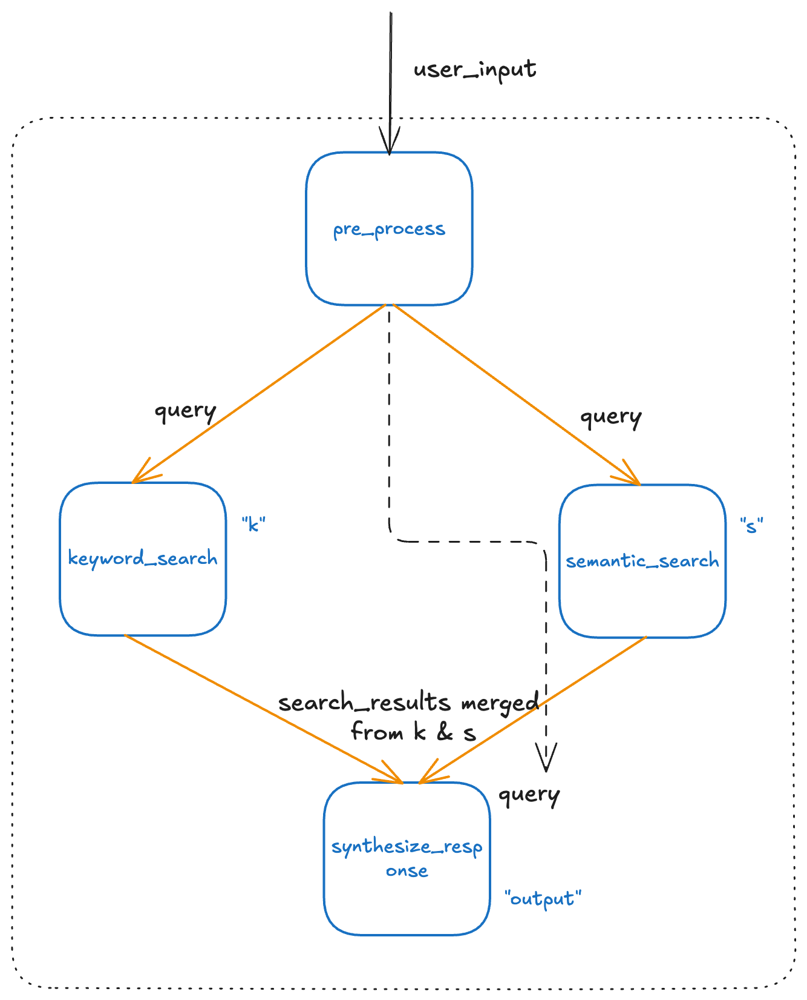

This document rewrites all the examples in [README](/README.md) using the declarative API instead of ASL. These examples are used for comparison and learning.

## 🚀 Code Examples

### 0. LLM Setup

First of all, create a LLM instance for later use.

```python
import os
from bridgic.llms.openai import OpenAILlm, OpenAIConfiguration
from bridgic.core.model.types import Message, Role

# Get the API key and model name from environment variables.
_api_key = os.environ.get("OPENAI_API_KEY")
_model_name = os.environ.get("OPENAI_MODEL_NAME")

llm = OpenAILlm(
    api_key=_api_key,
    timeout=5,
    configuration=OpenAIConfiguration(model=_model_name),
)
```

### 1. The SplitSolveAgent & Chatbot Example

Define `SplitSolveAgent`:

```python
from typing import List, Dict
from bridgic.core.model.types import Message, Role
from bridgic.core.automa import GraphAutoma, worker

class SplitSolveAgent(GraphAutoma):
    # Break down the query into a list of sub-queries.
    @worker(is_start=True)
    async def break_down_query(self, user_input: str) -> List[str]:
        llm_response = await llm.achat(
            messages=[
                Message.from_text(text=f"Break down the query into multiple sub-queries and only return the sub-queries", role=Role.SYSTEM),
                Message.from_text(text=user_input, role=Role.USER,),
            ]
        )
        return [item.strip() for item in llm_response.message.content.split("\n") if item.strip()]

    # Define the function to conduct a web search.
    @worker(dependencies=["break_down_query"], is_output=True)
    async def query_answer(self, queries: List[str]) -> Dict[str, str]:
        answers = []
        for query in queries:
            response = await llm.achat(
                messages=[
                    Message.from_text(text=f"Answer the given query briefly", role=Role.SYSTEM),
                    Message.from_text(text=query, role=Role.USER,),
                ]
            )
            answers.append(response.message.content)
        
        res = {
            query: answer
            for query, answer in zip(queries, answers)
        }
        return res

split_solve_agent = SplitSolveAgent()
```

Define `Chatbot` that resues `SplitSolveAgent`:

```python
class Chatbot(GraphAutoma):
    @worker(is_output=True)
    async def merge_answers(self, qa_pairs: Dict[str, str], user_input: str) -> str:
        answers = "\n".join([v for v in qa_pairs.values()])
        llm_response = await llm.achat(
            messages=[
                Message.from_text(text=f"Merge the given answers into a unified response to the original question", role=Role.SYSTEM),
                Message.from_text(text=f"Query: {user_input}\nAnswers: {answers}", role=Role.USER),
            ]
        )
        return llm_response.message.content

chatbot = Chatbot()
chatbot.add_worker(
    key="split_solve_agent",
    worker=split_solve_agent,
    is_start=True
)
chatbot.add_dependency("merge_answers", "split_solve_agent")
```

Run it:

```python
async def main():
    query = "When and where was Einstein born?"
    answer = await chatbot.arun(user_input=query)
    print(answer)

if __name__ == "__main__":
    import asyncio
    asyncio.run(main())
```

```
Albert Einstein was born on March 14, 1879, in Ulm, in the Kingdom of Württemberg in the German Empire.
```

### 2. Dynamic Routing

The `ferry_to()` API enables an automa to dynamically decide which worker should run next, allowing the workflow to adapt its execution path based on runtime conditions. This capability works hand in hand with static dependency declarations, making the execution process much more adaptive and intelligent. With dynamic routing powered by `ferry_to()`, you can easily build agentic systems that adjust their behavior at runtime.

```python
from bridgic.core.automa import GraphAutoma, worker

class SimpleRouter(GraphAutoma):
    @worker(is_start=True)
    async def routing_request(self, request: str) -> str:
        print(f"Routing request: {request}")
        if "?" in request:  # Route using a simple rule that checks for "?"
            self.ferry_to("hq", question=request)
        else:
            self.ferry_to("hg", question=request)

    @worker(key="hq", is_output=True)
    async def handle_question(self, question: str) -> str:
        print("❓ QUESTION: Processing question")
        llm_response = await llm.achat(
            messages=[
                Message.from_text(text=f"You are a helpful assistant", role=Role.SYSTEM),
                Message.from_text(text=question, role=Role.USER,),
            ]
        )
        return llm_response.message.content

    @worker(key="hg", is_output=True)
    async def handle_general(self, question: str) -> str:
        print("📝 GENERAL: Processing general input")
        llm_response = await llm.achat(
            messages=[
                Message.from_text(text=f"Carry out the user's instructions faithfully and briefly", role=Role.SYSTEM),
                Message.from_text(text=question, role=Role.USER,),
            ]
        )
        return llm_response.message.content

async def main():
    """Run the simple router example."""
    router = SimpleRouter()
    test_requests = [
        "When and where was Einstein born?",
        "Create a poeom about love."
    ]
    for request in test_requests:
        print(f"\n--- Processing: {request} ---")
        response = await router.arun(request=request)
        print(f"--- Response: \n{response}")

if __name__ == "__main__":
    import asyncio
    asyncio.run(main())
```

```
--- Processing: When and where was Einstein born? ---
Routing request: When and where was Einstein born?
❓ QUESTION: Processing question
--- Response: 
Albert Einstein was born on March 14, 1879, in Ulm, in the Kingdom of Württemberg in the German Empire.

--- Processing: Create a poeom about love. ---
Routing request: Create a poeom about love.
📝 GENERAL: Processing general input
--- Response: 
In whispers soft, where heartbeats dance,  
Love blooms in silence, a sweet romance.  
Like stars that twinkle in the night,  
Two souls entwined, their spirits bright.  
...
```

The smart router example showcases how `ferry_to()` enables conditional execution paths. The system analyzes each request and dynamically chooses the appropriate handler, demonstrating how agents can make dynamic routing decisions based on the nature of incoming data.

### 3. Dynamic Topology

Bridgic introduces a novel orchestration model built on a DDG (Dynamic Directed Graph), in which the graph topology can be modified at runtime. A typical use case is dynamically instantiating workers based on the number of items in a list returned by a previous task. Each item requires its own handler, but the number of required handlers is not known until runtime.


```python
from typing import List
from bridgic.core.automa import GraphAutoma, worker
from bridgic.core.automa.args import ArgsMappingRule

class DynamicGraph(GraphAutoma):
    @worker(is_start=True)
    async def produce_task(self, user_input: int) -> List[int]:
        tasks = [i for i in range(user_input)]
        handler_keys = []
        for task in tasks:
            # Dynamically create task handlers for each task
            handler_key = f"handler_{task}"
            self.add_func_as_worker(
                key=handler_key,
                func=self.task_handler
            )
            handler_keys.append(handler_key)
            self.ferry_to(handler_key, sub_task=task)
        
        self.add_func_as_worker(
            key="collect",
            func=self.collect,
            dependencies=handler_keys,
            args_mapping_rule=ArgsMappingRule.MERGE,
            is_output=True
        )
        return tasks

    async def task_handler(self, sub_task: int) -> int:
        res = sub_task + 1
        return res

    async def collect(self, res_list: List[int]) -> List[int]:
        return res_list

async def main():
    dynamic_graph = DynamicGraph()
    result = await dynamic_graph.arun(user_input=3)
    print(f"--- Result: \n{result}")

if __name__ == "__main__":
    import asyncio
    asyncio.run(main())
```

```
--- Result: 
[1, 2, 3]
```

### 4. Parameter Resolving

The following example demonstrates the capability of parameter resolving. Suppose we are building a RAG-based question-answering system: the user input is processed through two concurrent retrieval paths—keyword search and semantic search. Each path retrieves a set of chunks, which are then merged and used to generate a retrieval-augmented response.

```python
from typing import List, Tuple
from bridgic.core.automa import GraphAutoma, worker
from bridgic.core.automa.args import ArgsMappingRule, From

class RAGProcessor(GraphAutoma):
    @worker(is_start=True)
    async def pre_process(self, user_input: str) -> str:
        return user_input.strip()

    @worker(key="k", dependencies=["pre_process"])
    async def keyword_search(self, query: str) -> List[str]:
        # Simulate keyword search by returning a fixed list of chunks.
        chunks = [
            "Albert Einstein was born on March 14, 1879, in Ulm, in the Kingdom of Württemberg, Germany  (now simply part of modern Germany).",
            "Einstein was born into a secular Jewish family Biography.",
            "Einstein had one sister, Maja, who was born two years after him.",
        ]
        return chunks

    @worker(key="s", dependencies=["pre_process"])
    async def semantic_search(self, query: str) -> List[str]:
        # Simulate semantic search by returning a fixed list of chunks.
        chunks = [
            "Albert Einstein was born on March 14, 1879, in Ulm, in the Kingdom of Württemberg in the German Empire (now part of Germany).",
            "Shortly after his birth, his family moved to Munich, where he spent most of his childhood.",
            "Einstein excelled at physics and mathematics from an early age, teaching himself algebra, calculus, and Euclidean geometry by age twelve.",
        ]
        return chunks

    @worker(dependencies=["k", "s"], args_mapping_rule=ArgsMappingRule.MERGE, is_output=True)
    async def synthesize_response(
        self,
        search_results: Tuple[List[str], List[str]], 
        query: str = From("pre_process")
    ) -> str:
        chunks_by_keyword, chunks_by_semantic = search_results
        all_chunks = chunks_by_keyword + chunks_by_semantic
        prompt = f"{query}\n---\nAnswer the above question based on the following references.\n{all_chunks}"
        print(f"{prompt}\n------------------\n")
        llm_response = await llm.achat(
            messages=[
                Message.from_text(text=f"You are a helpful assistant", role=Role.SYSTEM),
                Message.from_text(text=prompt, role=Role.USER),
            ]
        )
        return llm_response.message.content
```

<div align="center">
    
</div>

**Key points:**

- **`query` argument** - The `query` arguments of `keyword_search` and `semantic_search` are received from the result of `pre_process` through the **Arguments Mapping** mechanism.
- **`args_mapping_rule=ArgsMappingRule.MERGE`** - the `MERGE` mode of the **Arguments Mapping** rule is specified, which makes the results of `keyword_search` and `semantic_search` merged into the `search_results` argument of `synthesize_response`.
- **`From("pre_process")`** - Injects the result of `pre_process` into the `query` argument of `synthesize_response`.

Create an instance of `RAGProcessor` and run it:

```python
async def main():
    rag = RAGProcessor()
    result = await rag.arun(user_input="When and where was Einstein born?")
    print(f"Final response: \n{result}")

if __name__ == "__main__":
    import asyncio
    asyncio.run(main())
```

```
When and where was Einstein born?
---
Answer the above question based on the following references.
['Albert Einstein was born on March 14, 1879, in Ulm, in the Kingdom of Württemberg, Germany  (now simply part of modern Germany).', 'Einstein was born into a secular Jewish family Biography.', 'Einstein had one sister, Maja, who was born two years after him.', 'Albert Einstein was born on March 14, 1879, in Ulm, in the Kingdom of Württemberg in the German Empire (now part of Germany).', 'Shortly after his birth, his family moved to Munich, where he spent most of his childhood.', 'Einstein excelled at physics and mathematics from an early age, teaching himself algebra, calculus, and Euclidean geometry by age twelve.']
------------------

Final response: 
Albert Einstein was born on March 14, 1879, in Ulm, in the Kingdom of Württemberg, Germany.
```

### 5. ReAct in Bridgic

```python
from bridgic.core.agentic import ReActAutoma

async def get_weather(
    city: str,
) -> str:
    """
    Retrieves current weather for the given city.

    Parameters
    ----------
    city : str
        The city to get the weather of, e.g. New York.
    
    Returns
    -------
    str
        The weather for the given city.
    """
    # Mock the weather API call.
    return f"The weather in {city} is sunny today and the temperature is 20 degrees Celsius."

async def main():
    react = ReActAutoma(
        llm=llm,
        tools=[get_weather],
        system_prompt="You are a weatherman that is good at forcasting weather by using tools.",
    )
    result = await react.arun(user_msg="What is the weather in Tokyo?")
    print(f"Final response: \n{result}")

if __name__ == "__main__":
    import asyncio
    asyncio.run(main())
```

```
Final response: 
The weather in Tokyo is sunny today, with a temperature of 20 degrees Celsius.
```

In Bridgic, an automa can be resued as a tool by `ReActAutoma`, in a component-oriented fashion.

```python
from bridgic.core.automa import GraphAutoma, worker
from bridgic.core.agentic.tool_specs import as_tool
from bridgic.core.agentic import ReActAutoma

def multiply(x: int, y: int) -> int:
    """
    This function is used to multiply two numbers.

    Parameters
    ----------
    x : int
        The first number to multiply
    y : int
        The second number to multiply

    Returns
    -------
    int
        The product of the two numbers
    """
    # Note: this function need not to be implemented.
    ...

@as_tool(multiply)
class MultiplyAutoma(GraphAutoma):
    @worker(is_start=True, is_output=True)
    def multiply(self, x: int, y: int):
        return x * y

async def main():
    react = ReActAutoma(
        llm=llm,
        system_prompt="You are a helpful assistant that is good at calculating by using tools.",
    )
    result = await react.arun(
        user_msg="What is 235 * 4689?",
        chat_history=[
            {
                "role": "user",
                "content": "Could you help me to do some calculations?",
            },
            {
                "role": "assistant",
                "content": "Of course, I can help you with that.",
            }
        ],
        # tools may be provided at runtime in Bridgic `ReActAutoma`.
        tools=[MultiplyAutoma],
    )
    print(f"Final response: \n{result}")

if __name__ == "__main__":
    import asyncio
    asyncio.run(main())
```

```
Final response: 
The result of \( 235 \times 4689 \) is 1,101,915.
```

**Key points:**

- **`tools=[MultiplyAutoma]`** - **Automa as a tool!**
- **`tools=[MultiplyAutoma]`** - The `tools` argument can be passed either to `react.arun` at runtime or during the initialization of `ReActAutoma`.
