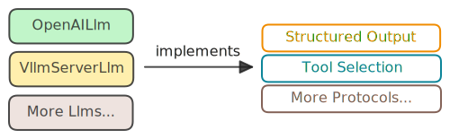

# Model Integration

## Our Philosophy

- Model Neutrality
- Protocol Driven Design

Bridgic is designed as a **model-neutral framework** that treats all LLM providers - whether they are commercial vendors (OpenAI, etc.) or inference engines (vLLM, etc.) - as equals. This architectural decision will reduce the extra effort developers need to put in when switching models.

### Model Neutrality

Bridgic’s API is fundamentally **model-neutral**. When designing our interfaces, we deliberately avoid assumptions about any particular model provider or technology. Instead, we focus on delivering:

- **Functional Simplicity**: The APIs are intuitive and easy to use, allowing you to interact with any supported model provider through clear and minimal calls, with no provider-specific complexity.
- **Consistent Experience**: Regardless of which underlying LLM or model engine you use, Bridgic ensures a uniform invocation model, standardized error handling, and predictable behavior.

This model-agnostic approach allows you to swap, extend, or combine providers with minimal friction, promoting genuine flexibility and future-proof integration in your agent pipelines.

### Protocol Driven Design

At the heart of Bridgic's model integration lies the **Protocol Pattern**, which defines clear behavioral contracts without imposing implementation details. This design enables:

1. **Extensibility**: New model providers can be integrated by implementing well-defined protocols (`StructuredOutput`, `ToolSelection`, etc.)
2. **Capability Declaration**: Each provider explicitly declares its capabilities through protocol implementation, making it clear what features are available
3. **Flexibility**: Providers can implement only the protocols they support, avoiding forced compatibility with unsupported features
4. **Type Safety**: Protocols provide compile-time type checking and IDE support, improving developer experience

  

This architecture means that when you work with a model provider in Bridgic, you explicitly know what capabilities it offers, and the framework enforces these contracts at both development and runtime.