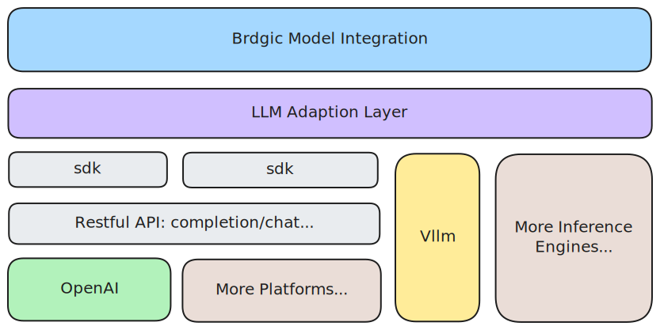
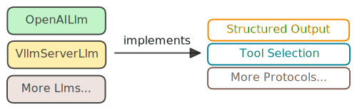

# 模型

## 我们的理念

- 模型中立性
- 协议驱动设计

Bridgic 被设计为一个 **模型中立框架**，将所有 LLM 提供商——无论是商业供应商（OpenAI 等）还是推理引擎（vLLM 等）——视为平等。这一架构决策将减少开发者在切换模型时所需付出的额外努力。

### 模型中立性

Bridgic 的 API 从根本上是 **模型中立** 的。在设计我们的接口时，我们故意避免对任何特定模型提供商或技术的假设。相反，我们专注于提供：

- **功能简单性**：API 直观且易于使用，允许您通过清晰且简洁的调用与任何支持的模型提供商进行交互，而无需特定于提供商的复杂性。
- **一致的体验**：无论您使用哪个底层 LLM 或模型引擎，Bridgic 确保统一的调用模型、标准化的错误处理和可预测的行为。

这种与模型无关的方法使您能够以最小的摩擦交换、扩展或组合提供商，从而促进真正的灵活性和未来-proof 的集成在您的代理管道中。

### 协议驱动设计

Bridgic 模型集成的核心是 **协议模式**，它定义了明确的行为契约，而不强加实现细节。该设计使得：

1. **可扩展性**：可以通过实现明确定义的协议（[`StructuredOutput`](../../../../reference/bridgic-core/bridgic/core/model/protocols/#bridgic.core.model.protocols.StructuredOutput)、[`ToolSelection`](../../../../reference/bridgic-core/bridgic/core/model/protocols/#bridgic.core.model.protocols.ToolSelection) 等）集成新的模型提供商
2. **能力声明**：每个提供商通过协议实现明确声明其能力，使可用的功能一目了然
3. **灵活性**：提供商可以仅实现他们支持的协议，避免与不支持的功能强制兼容
4. **类型安全**：协议提供编译时类型检查和 IDE 支持，改善开发者体验

  

这种架构意味着，当您在 Bridgic 中与模型提供商合作时，您明确知道它提供的能力，并且框架在开发和运行时都强制执行这些契约。