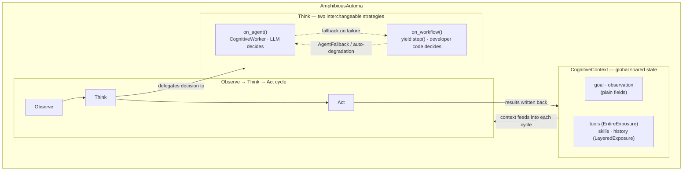

# Bridgic Amphibious

**Dual-mode agent framework** — build agents that operate in both LLM-driven and deterministic modes, with automatic fallback between them.

## Core Design Philosophy

### 1. Agent = Think Units + Context Orchestration

Traditional agent frameworks require developers to work with low-level execution primitives. Bridgic Amphibious raises the abstraction level: an agent is defined by **declaring think units** and **orchestrating them with context**.

```python
class TravelAgent(AmphibiousAutoma[TravelContext]):
    # Declare think units — each encapsulates a specific thinking pattern
    planner = think_unit(
        CognitiveWorker.inline("Analyze the goal and decide the next step"),
        max_attempts=20,
    )

    async def on_agent(self, ctx: TravelContext):
        # Orchestrate think units with context scoping
        async with self.sequential(goal="Plan the trip"):
            await self.planner

        async with self.loop(goal="Execute each step of the plan"):
            await self.planner
```

Each `await self.planner` triggers a complete **observe-think-act** cycle:
1. **Observe** — gather the current state (overridable at both worker and agent level)
2. **Think** — LLM decides the next action based on context and available tools
3. **Act** — execute tool calls or produce structured output

The developer focuses on *what* to think about and *how to scope context*, not on the mechanics of LLM calls, tool matching, or output parsing.

### 2. Functional Execution vs. Decision Making — Decoupled

In traditional software, *what to do* and *when to do it* are intertwined in code logic. Bridgic Amphibious cleanly separates them:

- **Functional modules** (tools, skills) — pure capabilities, independent of execution order
- **Decision making** — can be handled in two fundamentally different ways:

| Mode | Decision Maker | Defined In | Best For |
|------|---------------|-----------|----------|
| **Workflow** (`on_workflow`) | Developer's code | `yield step(...)` | Known, repeatable processes |
| **Agent** (`on_agent`) | LLM reasoning | `await self.think_unit` | Open-ended, adaptive tasks |

The same agent can implement **both** modes and switch between them at runtime:

```python
class ResilientAgent(AmphibiousAutoma[MyContext]):
    exec_think = think_unit(CognitiveWorker.inline("Execute step"), max_attempts=10)

    async def on_agent(self, ctx):
        """LLM-driven mode: AI decides what to do."""
        await self.exec_think

    async def on_workflow(self, ctx):
        """Deterministic mode: developer defines the exact steps."""
        yield step("login", username="admin", password="secret")
        yield step("navigate_to", url="/dashboard")
        result = yield step("extract_data", selector=".metrics")

        # Fall back to agent for complex situations
        yield AgentFallback(goal="Analyze the extracted data", max_attempts=5)
```

**Runtime mode switching** happens automatically:
- **Workflow failure → Agent fallback**: If a workflow step fails, the framework can automatically switch to agent mode to resolve the issue, then resume the workflow
- **Configurable degradation**: `max_consecutive_fallbacks` controls when to abandon the workflow entirely and hand over to full agent mode
- **Explicit mode control**: `arun(mode=RunMode.AGENT)` or `arun(mode=RunMode.AMPHIBIOUS)`

## Architecture



The three rows capture the essence of the framework:
- **Row 1 — Context**: the global state that all modes share, with Exposure controlling how data is disclosed to the LLM
- **Row 2 — OTA cycle**: the fixed observe-think-act loop that every execution passes through
- **Row 3 — Think strategies**: the decision point where `on_agent` (LLM) and `on_workflow` (code) are interchangeable, with dynamic fallback between them

### Layer 1: Data Exposure

Controls how context data is disclosed to the LLM.

- **`EntireExposure[T]`** — All data visible at once (used for tools)
- **`LayeredExposure[T]`** — Progressive disclosure: summary first, details on demand (used for skills, history)

```python
# The LLM sees skill summaries initially
# It can request details via the acquiring policy:
#   details: [{field: "skills", index: 0}]
# The framework then reveals the full skill content
```

### Layer 2: Context

`Context` is a Pydantic `BaseModel` that auto-detects Exposure fields and provides `summary()`, `get_details()`, and `format_summary()`.

`CognitiveContext` is the default implementation with:
- `goal` — what the agent is trying to achieve
- `tools` (EntireExposure) — available tool specifications
- `skills` (LayeredExposure) — available skills with progressive disclosure
- `cognitive_history` (LayeredExposure) — execution history with layered memory:
  - **Working memory**: recent steps with full details
  - **Short-term memory**: older steps as summaries, queryable for details
  - **Long-term memory**: compressed via LLM into concise summaries

### Layer 3: CognitiveWorker (Think Unit)

A `CognitiveWorker` is a pure thinking unit — it only decides *what to do*, not *how to execute*.

```python
class AnalysisWorker(CognitiveWorker):
    async def thinking(self):
        return "Analyze the current situation and decide the best next action."

    async def observation(self, context):
        # Custom observation logic
        return f"Page title: {await get_page_title()}"

# Or use the factory for simple cases:
worker = CognitiveWorker.inline("Plan ONE immediate next step")
```

**Cognitive Policies** enhance thinking with optional multi-round deliberation:
- **Acquiring** (built-in) — request details from LayeredExposure fields before deciding
- **Rehearsal** (opt-in) — mentally simulate the planned action before committing
- **Reflection** (opt-in) — assess information quality and consistency

Each policy fires **at most once** per cycle, then closes.

**Structured Output**: Set `output_schema` to skip the tool-call loop entirely and produce a typed Pydantic instance:

```python
class PlanResult(BaseModel):
    phases: List[Phase]
    estimated_steps: int

planner = CognitiveWorker.inline(
    "Create an execution plan",
    output_schema=PlanResult,
)
```

### Layer 4: AmphibiousAutoma (Orchestration)

The top-level agent class that ties everything together.

**Think Unit Descriptors** declare reusable thinking patterns at the class level:

```python
class MyAgent(AmphibiousAutoma[CognitiveContext]):
    # Declare think units as class attributes
    main_think = think_unit(
        CognitiveWorker.inline("Execute the next step"),
        max_attempts=20,
        on_error=ErrorStrategy.RETRY,
        max_retries=2,
    )

    async def on_agent(self, ctx):
        # Simple: single execution
        await self.main_think

        # With loop condition
        await self.main_think.until(
            lambda ctx: some_condition(ctx),
            max_attempts=50,
        )

        # With tool/skill filtering
        await self.main_think.until(
            lambda ctx: ctx.goal_reached,
            tools=["search", "analyze"],
            skills=["data_extraction"],
        )
```

**Phase Annotation** scopes context and captures execution traces:

```python
async def on_agent(self, ctx):
    async with self.sequential(goal="Gather information"):
        await self.research_think

    async with self.loop(goal="Process each item"):
        await self.process_think

    async with self.snapshot(goal="Handle edge case", custom_field="override"):
        await self.fix_think
```

- `sequential()` — groups steps into a linear phase
- `loop()` — groups steps into a loop phase with pattern detection
- `snapshot()` — temporarily overrides context fields

## Quick Start

### Installation

```bash
pip install bridgic-amphibious
```

### Minimal Agent (Agent Mode)

```python
from bridgic.amphibious import (
    AmphibiousAutoma, CognitiveContext, CognitiveWorker, think_unit
)

class SimpleAgent(AmphibiousAutoma[CognitiveContext]):
    executor = think_unit(
        CognitiveWorker.inline("Decide and execute the next step"),
        max_attempts=10,
    )

    async def on_agent(self, ctx):
        await self.executor

# Run
agent = SimpleAgent(llm=my_llm)
await agent.arun(goal="Book a flight from Beijing to Tokyo", tools=[...])
```

### Minimal Agent (Workflow Mode)

```python
from bridgic.amphibious import AmphibiousAutoma, CognitiveContext, step

class WorkflowAgent(AmphibiousAutoma[CognitiveContext]):
    async def on_agent(self, ctx):
        pass  # Required but not used in pure workflow mode

    async def on_workflow(self, ctx):
        result = yield step("search_flights", origin="Beijing", destination="Tokyo", date="2024-06-01")
        yield step("book_flight", flight_number="CA123")

# Runs in amphibious mode (workflow + agent fallback)
agent = WorkflowAgent(llm=my_llm)
await agent.arun(goal="Book a flight", tools=[...])
```

### Amphibious Mode (Workflow + Agent Fallback)

```python
class AmphibiousAgent(AmphibiousAutoma[CognitiveContext]):
    fixer = think_unit(
        CognitiveWorker.inline("Fix the current issue and complete the step"),
        max_attempts=5,
    )

    async def on_agent(self, ctx):
        await self.fixer

    async def on_workflow(self, ctx):
        yield step("login", username="admin", password="secret")
        yield step("navigate_to", url="/dashboard")
        # If any step fails, the framework falls back to on_agent() to resolve it

agent = AmphibiousAgent(llm=my_llm)
await agent.arun(
    goal="Extract dashboard data",
    tools=[...],
    mode=RunMode.AMPHIBIOUS,      # or RunMode.AUTO (default, auto-detects)
    will_fallback=True,            # enable agent fallback on failure
    max_consecutive_fallbacks=2,   # switch to full agent mode after 2 consecutive failures
)
```

### Custom Context

```python
from bridgic.amphibious import CognitiveContext, CognitiveHistory
from pydantic import Field, ConfigDict

class MyContext(CognitiveContext):
    model_config = ConfigDict(arbitrary_types_allowed=True)

    current_page: str = Field(default="", description="Current page URL")
    extracted_data: dict = Field(default_factory=dict)

class MyAgent(AmphibiousAutoma[MyContext]):
    ...
```

### Execution Tracing

```python
agent = MyAgent(llm=my_llm)
await agent.arun(goal="...", tools=[...], trace_running=True)

# Access trace data
trace = agent._agent_trace.build()

# Save to file
agent._agent_trace.save("trace.json")
```

## Key Concepts

| Concept | Description |
|---------|------------|
| **CognitiveWorker** | Pure thinking unit — decides *what* to do |
| **think_unit** | Descriptor for declaring workers with execution parameters |
| **AmphibiousAutoma** | Agent orchestrator with dual execution modes |
| **on_agent()** | LLM-driven orchestration logic |
| **on_workflow()** | Deterministic workflow as async generator |
| **Exposure** | Data visibility abstraction (Entire vs. Layered) |
| **CognitiveContext** | Agent state: goal, tools, skills, history |
| **Cognitive Policies** | Acquiring, rehearsal, reflection — enhance thinking |
| **AgentTrace** | Structured execution trace for inspection |
| **ErrorStrategy** | RAISE, IGNORE, or RETRY on failures |
| **AgentFallback** | Yield in on_workflow() to delegate to agent mode |
| **RunMode** | AGENT, WORKFLOW, AMPHIBIOUS, or AUTO |

## License

See the repository root for license information.
